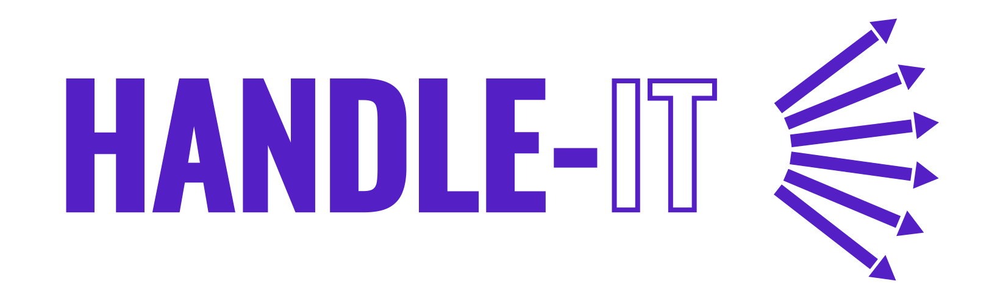

# Handle-it



[](https://codecov.io/gh/makavelithadon/handle-it)
[](https://badgen.net/bundlephobia/minzip/handle-it)
[](https://badgen.net/npm/v/handle-it)
[](https://badgen.net/npm/license/handle-it)
[](https://badgen.net/npm/types/handle-it)

> A tiny wrapper around event subscribing

## Install

```sh
npm install handle-it
```

## Usage

```ts
import { on, off, debug } from 'handle-it';

// Subscribe to 'resize' event on Window global object
on(window, 'resize', ({ target: { innerWidth, innerHeight } }) => {
  console.log(`'resize' event triggered on window`);
  console.log(`[window new width]: ${innerWidth}`);
  console.log(`[window new height]: ${innerHeight}`);
});

// Create a button and add it to the DOM
const button = document.createElement('button');
document.body.append(button);

const onClick = () => {
  console.log(`'click' event triggered on button Element`);
};

window.dispatchEvent(new Event('resize'));
// => trigger:
//      console.log(`'resize' event triggered on window`);
//      ...
//      ...

button.dispatchEvent(new MouseEvent('click'));
// => trigger:
//      console.log(`'click' event triggered on button Element`);

off(button, 'click', onClick); // => Remove onClick handler to be called on futur 'click' events triggered/dispatched on buttonElement
off(window); // => remove ALL events that have been registered with 'handle-it' fro the window global object

// Register a lot of event handlers
const onButtonClick = () => {};
on(button, 'click', onbuttonClick);
on(button, 'click', () => {});
on(button, 'mouseover', () => {});
on(button, 'mouseleave', () => {});
on(button, 'touchstart', () => {});
on(document, 'click', () => {});
on(window, 'resize', () => {});
on(window, 'load', () => {});
on(document.createElement('img'), 'load', () => {});

// Return the JS Map that contains all the event handlers registered by 'handle-it'
console.log(debug());

// => Map(4) {
//   button => {
//     click: [fn(), fn()],
//     mouseover: [fn()],
//     mouseleave: [fn()],
//     touchstart: [fn()],
//   },
//   Window => {
//     resize: [fn()],
//     load: [fn()],
//   },
//   document => {
//     click: [fn()]
//   },
//   img => {
//     load: [fn()]
//   },
// };

// Remove only 'click' vent from button Element
off(button, 'click', onButtonClick);

// Remove all listeners for 'click' event on button Element
off(button, 'click);

// Remove all event listeners for alle events on button element ('mouseover', 'mouseleave' and 'touchstart')
off(button);

// Remove all remaining element/event/listners
off(document);
off(window);
```

## API

### on(element, event, callback)

#### element

Type: `Element | Window | Document`

The object that will get the event listener attached (`callback` parameter)

#### event

Type: `Event` (`'click'`, `'resize'`, `'load'`, `'ready'`, `'input'`...)

The event to listen on the given element

#### callback

Type: `VoidFunction`

example:

The event listener to be triggered when the event will be emitted ont the element

```js
on(window, 'resize', myResizerListener);
```

### off(element, event?, callback?)

#### element

Type: `Element | Window | Document`

The object from which we want to remove event handlers

#### event

Type: `Event` (`'click'`, `'resize'`, `'load'`, `'ready'`, `'input'`...)

The event for which we want to remove event handlers

#### callback

Type: `VoidFunction`

example:

The event listener to remove given the element and for a specific event

```js
// Remove ALL events registered/listened
off(window);

// Remove ONLY 'resize' event from Window object
off(window, 'resize');

// Remove ONLY the registered myWindowResizeListener listener for the 'resize' event on Window object
off(window, 'resize', myWindowResizeListener);
```

## License

MIT

## Contributing

- Fork this repository
- Create a Pull Request
- Wait for review/approval in order to merge the PR

## Development

- clone this repository
- cd to root folder project
- npm install to have all deps installed
- make your changes
- run tests (`npm test`), you can also run tests in watch mode (`npm test --watchAll`) to re-run them on file changes
- run `npm run build` to ensure the lib is built correctly
- you can use the playground (`/playground` folder) to ensure the built lib is working correctly by try it yourself and make your changes on the `/playground/index.js` file (run a tiny server like [Live Server](https://marketplace.visualstudio.com/items?itemName=ritwickdey.LiveServer) to watch and reload on files changes)

## Build

The library is built with 3 output formats:

- [ESM](https://nodejs.org/api/esm.html#modules-ecmascript-modules)
- [CommonJS](https://nodejs.org/api/modules.html#modules-commonjs-modules)
- UMD (implicit dependencies and raw usage with a good'ol `<script>` requiring the library from a CDN - [unpkg](https://unpkg.com/) for this library)
